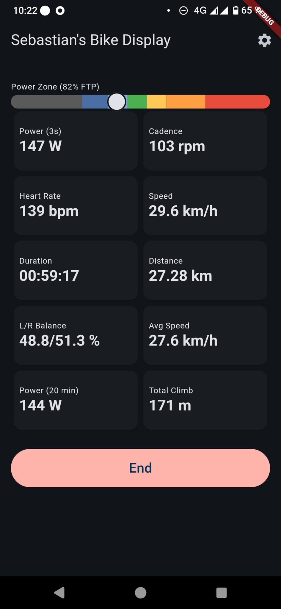

# Sebastian's Bike Display

A simple bike computer app showing important stats and recording
the ride.

The app is tailored to my needs and I probably won't accept PRs that changes
how it works, except bug fixes. However, feel free to fork the repo and do your own
thing.

## Strava auto-upload

Finished rides can be uploaded to Strava automatically via a proxy server.

The Strava app isn't configured for many requests per day, so if you make a popular fork, set up your own proxy & app:

1. Create a Strava API application and note its client ID and client secret.
   In Strava, set the authorization callback domain to `sebastiansbikedisplay`.
   The app uses the redirect URI `sebastiansbikedisplay://sebastiansbikedisplay`.
2. The app client ID is hardcoded to `276719`, that needs to change then.
3. Deploy the Strava proxy server from this repository and set
   `STRAVA_CLIENT_SECRET` on that server.
4. point the app to a different proxy by passing
   `--dart-define=STRAVA_PROXY_BASE_URL=https://your-proxy.example.com/api/`.
5. Connect the Strava account that should receive uploads in the app's config screen.
6. Enable automatic uploads for finished rides in the app's config screen.

The app uploads the generated FIT file after each ride when auto-upload is enabled.

## Strava proxy server

This repository includes a Python 3 Strava proxy server so the Strava client
secret can be kept on the server side instead of in the app build:

- Server code: `/home/runner/work/sebastians-bike-display/sebastians-bike-display/server/strava_proxy_server.py`
- Deploy assets root: `/home/runner/work/sebastians-bike-display/sebastians-bike-display/server/deploy`
- Nginx bootstrap config (HTTP): `/home/runner/work/sebastians-bike-display/sebastians-bike-display/server/deploy/nginx/sbc.diegeekdie.com.conf`
- Nginx TLS config (HTTPS): `/home/runner/work/sebastians-bike-display/sebastians-bike-display/server/deploy/nginx/sbc.diegeekdie.com.tls.conf`
- Landing page template: `/home/runner/work/sebastians-bike-display/sebastians-bike-display/server/deploy/www/index.html`
- Systemd unit: `/home/runner/work/sebastians-bike-display/sebastians-bike-display/server/deploy/systemd/strava-upload-proxy.service`
- Deployment guide (Debian Trixie + Let's Encrypt): `/home/runner/work/sebastians-bike-display/sebastians-bike-display/server/deploy/strava-proxy-deployment.md`

## Development

There is a dev container with the needed tools for development.

Build & test with:

- `flutter pub get`
- `flutter analyze`
- `flutter test`
- `flutter build apk --debug`
- Or with custom proxy: `flutter build apk --debug --dart-define=STRAVA_PROXY_BASE_URL=https://your-proxy.example.com/api/`

## Android release signing for CI

Release builds are created automatically when a GitHub Release is published.
The workflow builds a signed `*-release.apk` and uploads it to the release assets.

Set these repository secrets before publishing a release:

- `ANDROID_KEYSTORE_BASE64`: Base64 encoded content of your `.jks`/`.keystore` file.
- `ANDROID_KEY_ALIAS`: Key alias in the keystore.
- `ANDROID_KEY_PASSWORD`: Key password for the alias.
- `ANDROID_STORE_PASSWORD`: Keystore password.

Generate and configure the key once:

1. Generate a keystore if you don't have one yet:
   - `keytool -genkey -v -keystore upload-keystore.jks -keyalg RSA -keysize 2048 -validity 10000 -alias upload`
2. Base64 encode it for GitHub secrets:
   - `base64 -w 0 upload-keystore.jks`
3. Add the output and the passwords/alias above as GitHub repository secrets.
4. Reuse the same keystore and alias for all future releases to keep APK signatures consistent.
